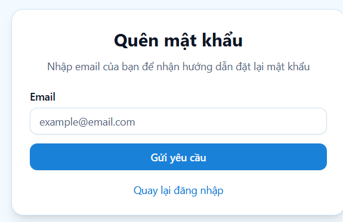

# Đồ Án Môn Học J2EE - Hệ Thống Quản Lý Hồ Sơ Y Tế Gia Đình

## Giới Thiệu
Medifamily là một hệ thống quản lý hồ sơ y tế gia đình, giúp các thành viên trong gia đình dễ dàng theo dõi tình trạng sức khỏe, lịch sử khám chữa bệnh và các thông tin y tế quan trọng. Hệ thống cung cấp các tính năng bảo mật, quản lý tài khoản người dùng, lưu trữ và truy xuất hồ sơ y tế một cách hiệu quả.

## Thành Viên Nhóm
- **Lương Gia Tuấn** - 31215600
- **Ngô Hữu Hoàng** - 3121560032
- **Phan Huỳnh Thanh Phong** - 3121560003

## Công Nghệ Sử Dụng
- **Backend**: Spring Boot, Spring Security, Spring Data JPA
- **Cơ sở dữ liệu**: ... Database
- **Frontend**: ReactJS
- **Authentication**: JWT (JSON Web Token)
- **API Documentation**: Swagger/OpenAPI
- **Quản lý dự án**: GitHub, Maven

## Chức Năng Chính
1. **Quản lý tài khoản**
   - Đăng ký, đăng nhập, xác thực người dùng bằng JWT
   - Phân quyền người dùng (Admin, Bác sĩ, Thành viên gia đình)
   
2. **Quản lý hồ sơ y tế**
   - Lưu trữ và truy xuất thông tin bệnh án, đơn thuốc
   - Theo dõi chỉ số sức khỏe (cân nặng, huyết áp, đường huyết,...)
   - Quản lý hồ sơ tiêm chủng
   
3. **Quản lý gia đình**
   - Kết nối các thành viên trong gia đình
   - Chia sẻ hồ sơ y tế giữa các thành viên
   
4. **Hỗ trợ bác sĩ**
   - Quản lý bệnh nhân
   - Xem và cập nhật thông tin y tế của bệnh nhân
   
5. **Hệ thống thông báo & nhắc nhở**
   - Nhắc nhở lịch uống thuốc, lịch khám
   - Gửi thông báo khi có cập nhật về hồ sơ y tế
  
##DEMO 

## **2.3 GIAO DIỆN**
##### Hình 16: Landing page

##### Hình 17: Màn hình đăng nhập

##### Hình 18: Màn hình đăng ký tài khoản

##### Hình 19: Đăng ký làm bác sĩ

##### Hình 20: Màn hình quên mật khẩu

### 2.3.1 Giao diện chính

Nhóm người dùng là Người bình thường:

##### Hình 21: Màn hình tổng quan

##### Hình 22: Màn hình quản lý các hộ gia đình

##### Hình 23: Màn hình thêm gia đình        

##### Hình 24: Màn hình quản lý thành viên của 1 gia đình

##### Hình 25: Màn hình chia sẻ thông tin gia đình

##### Hình 26: Màn hình danh sách link chia sẻ gia đình

##### Hình 27: Màn hình sửa gia đình

##### Hình 28: Màn hình thông tin cá nhân thành viên

##### Hình 29: Màn hình quản lý tài liệu của thành viên

##### Hình 30: Màn hình tải lên tài liệu thành viên

##### Hình 31: Màn hình quản lý chỉ số y tế thành viên

##### Hình 32: Màn hình lịch sử khám bệnh

##### Hình 33: Màn hình thêm hồ sơ khám bệnh mới

##### Hình 34: Màn hình chỉ tiết hồ sơ khám, quản lý đơn thuốc

##### Hình 35: Màn hình thêm thuốc

##### Hình 36: Màn hình quản lý lịch tim

##### Hình 37: Màn hình quản lý gia đình cho bác sĩ quản lý
